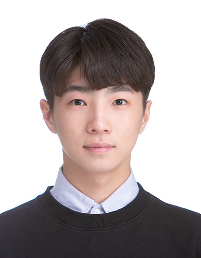
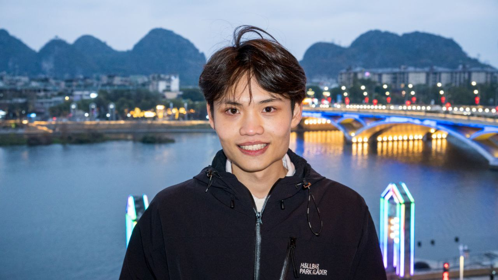

We are a team based in the [School of Computing, National University of Singapore](https://www.comp.nus.edu.sg).

You can reach us at the email `seer[at]comp.nus.edu.sg`

## Project team

### John Doe

[[homepage](http://www.comp.nus.edu.sg/~damithch)]
[[github](https://github.com/johndoe)]
[[portfolio](team/johndoe.md)]

* Role: Project Advisor

### Hong Seokjoon

[[github](http://github.com/seokjoon27)]
[[portfolio](team/seokjoon27.md)]

* Role: Code Quality
* Responsibilities: Check for coding standards and git conventions, ensure code quality. 

### Ong Jun Wei(Evan)

[[github](https://github.com/evanjw2)] [[portfolio](team/johndoe.md)]

* Role: Team lead
* Responsibilities: Responsible for overall project coordination.

### Jean Doe

[[github](http://github.com/johndoe)]
[[portfolio](team/johndoe.md)]

* Role: Developer
* Responsibilities: Dev Ops + Threading

### James Doe

[[github](http://github.com/johndoe)]
[[portfolio](team/johndoe.md)]

* Role: Developer
* Responsibilities: UI
