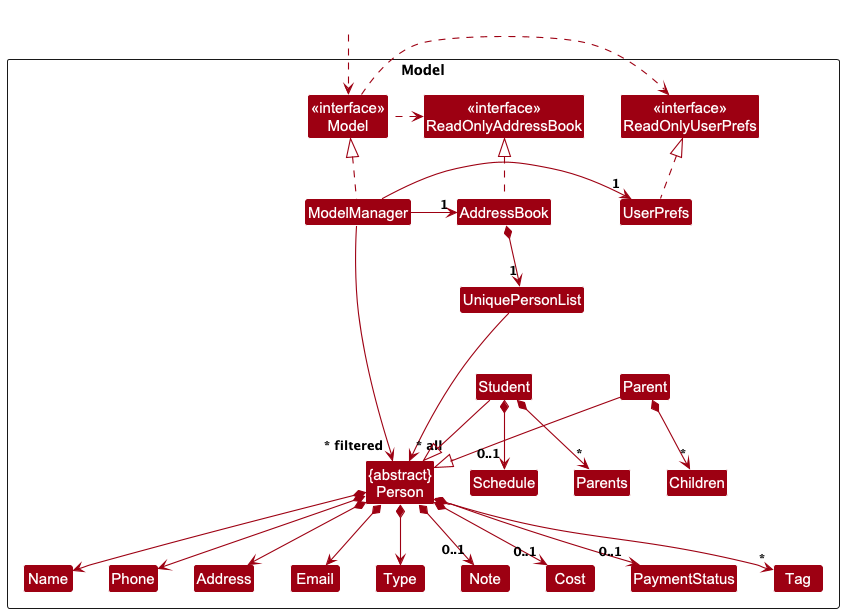
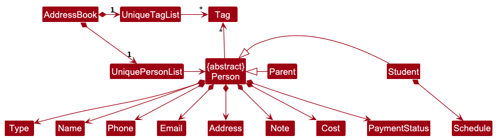
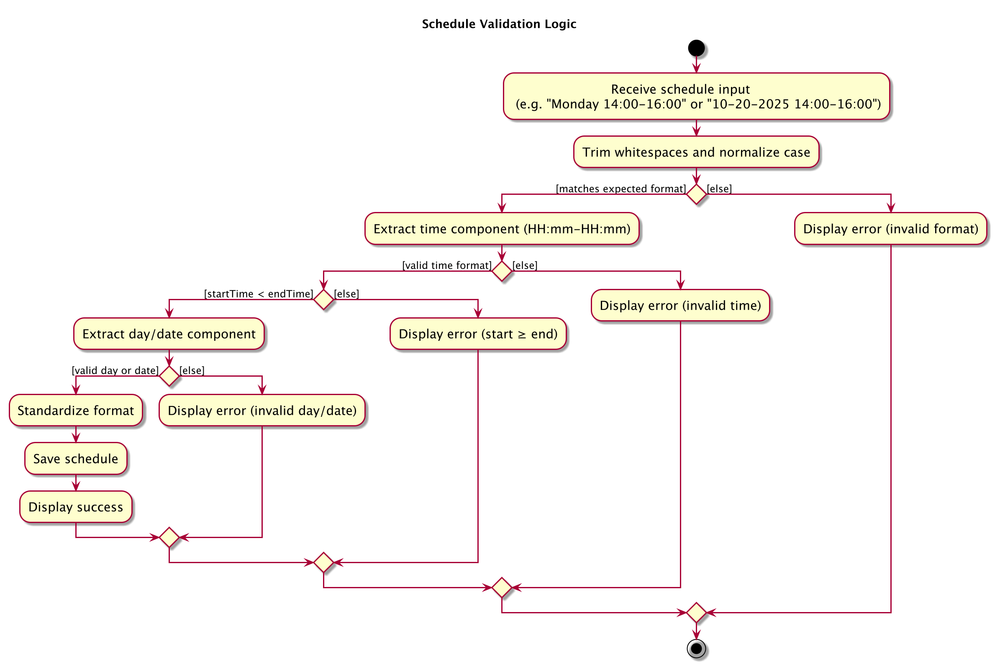

* Table of Contents
{:toc}


--------------------------------------------------------------------------------------------------------------------


## **Acknowledgements**


TutorHub is a greenfield group project that is based on [addressbook-level3](https://github.com/se-edu/addressbook-level3)(AB3) created by [SE-EDU](https://se-education.org/).


--------------------------------------------------------------------------------------------------------------------


## **1. Setting up, getting started**


Refer to the guide [_Setting up and getting started_](SettingUp.md).


--------------------------------------------------------------------------------------------------------------------


## **2. Design**


<div markdown="span" class="alert alert-primary">


:bulb: **Tip:** The `.puml` files used to create diagrams are in this document `docs/diagrams` folder. Refer to the [_PlantUML Tutorial_ at se-edu/guides](https://se-education.org/guides/tutorials/plantUml.html) to learn how to create and edit diagrams.
</div>


### 2.1 Architecture


The ***Architecture Diagram*** given above explains the high-level design of the App.


Given below is a quick overview of main components and how they interact with each other.


**Main components of the architecture**


**`Main`** (consisting of classes [`Main`](https://github.com/se-edu/addressbook-level3/tree/master/src/main/java/seedu/address/Main.java) and [`MainApp`](https://github.com/se-edu/addressbook-level3/tree/master/src/main/java/seedu/address/MainApp.java)) is in charge of the app launch and shut down.
* At app launch, it initializes the other components in the correct sequence, and connects them up with each other.
* At shut down, it shuts down the other components and invokes cleanup methods where necessary.


The bulk of the app's work is done by the following four components:


* [**`UI`**](#ui-component): The UI of the App.
* [**`Logic`**](#logic-component): The command executor.
* [**`Model`**](#model-component): Holds the data of the App in memory.
* [**`Storage`**](#storage-component): Reads data from, and writes data to, the hard disk.


[**`Commons`**](#common-classes) represents a collection of classes used by multiple other components.


**How the architecture components interact with each other**


The *Sequence Diagram* below shows how the components interact with each other for the scenario where the user issues the command `delete 1`.


Each of the four main components (also shown in the diagram above),


* defines its *API* in an `interface` with the same name as the Component.
* implements its functionality using a concrete `{Component Name}Manager` class (which follows the corresponding API `interface` mentioned in the previous point.


For example, the `Logic` component defines its API in the `Logic.java` interface and implements its functionality using the `LogicManager.java` class which follows the `Logic` interface. Other components interact with a given component through its interface rather than the concrete class (reason: to prevent outside component's being coupled to the implementation of a component), as illustrated in the (partial) class diagram below.


The sections below give more details of each component.


### 2.2 UI component


The **API** of this component is specified in [`Ui.java`](https://github.com/se-edu/addressbook-level3/tree/master/src/main/java/seedu/address/ui/Ui.java)


The UI consists of a `MainWindow` that is made up of parts e.g.`CommandBox`, `ResultDisplay`, `PersonListPanel`, `StatusBarFooter` etc. All these, including the `MainWindow`, inherit from the abstract `UiPart` class which captures the commonalities between classes that represent parts of the visible GUI.


The `UI` component uses the JavaFx UI framework. The layout of these UI parts are defined in matching `.fxml` files that are in the `src/main/resources/view` folder. For example, the layout of the [`MainWindow`](https://github.com/se-edu/addressbook-level3/tree/master/src/main/java/seedu/address/ui/MainWindow.java) is specified in [`MainWindow.fxml`](https://github.com/se-edu/addressbook-level3/tree/master/src/main/resources/view/MainWindow.fxml)


The `UI` component,


* executes user commands using the `Logic` component.
* listens for changes to `Model` data so that the UI can be updated with the modified data.
* keeps a reference to the `Logic` component, because the `UI` relies on the `Logic` to execute commands.
* depends on some classes in the `Model` component, as it displays `Person` object residing in the `Model`.


### 2.3 Logic component


**API** : [`Logic.java`](https://github.com/se-edu/addressbook-level3/tree/master/src/main/java/seedu/address/logic/Logic.java)


Here's a (partial) class diagram of the `Logic` component:


The sequence diagram below illustrates the interactions within the `Logic` component, taking `execute("delete 1")` API call as an example.


<div markdown="span" class="alert alert-info">:information_source: **Note:** The lifeline for `DeleteCommandParser` should end at the destroy marker (X) but due to a limitation of PlantUML, the lifeline continues till the end of diagram.
</div>


How the `Logic` component works:


1. When `Logic` is called upon to execute a command, it is passed to an `AddressBookParser` object which in turn creates a parser that matches the command (e.g., `DeleteCommandParser`) and uses it to parse the command.
1. This results in a `Command` object (more precisely, an object of one of its subclasses e.g., `DeleteCommand`) which is executed by the `LogicManager`.
1. The command can communicate with the `Model` when it is executed (e.g. to delete a person).<br>
   Note that although this is shown as a single step in the diagram above (for simplicity), in the code it can take several interactions (between the command object and the `Model`) to achieve.
1. The result of the command execution is encapsulated as a `CommandResult` object which is returned back from `Logic`.


Here are the other classes in `Logic` (omitted from the class diagram above) that are used for parsing a user command:


How the parsing works:
* When called upon to parse a user command, the `AddressBookParser` class creates an `XYZCommandParser` (`XYZ` is a placeholder for the specific command name e.g., `AddCommandParser`) which uses the other classes shown above to parse the user command and create a `XYZCommand` object (e.g., `AddCommand`) which the `AddressBookParser` returns back as a `Command` object.
* All `XYZCommandParser` classes (e.g., `AddCommandParser`, `DeleteCommandParser`, ...) inherit from the `Parser` interface so that they can be treated similarly where possible e.g, during testing.


### 2.4 Model component
**API** : [`Model.java`](https://github.com/se-edu/addressbook-level3/tree/master/src/main/java/seedu/address/model/Model.java)





The `Model` component,


* stores the address book data i.e., all `Person` objects (which are contained in a `UniquePersonList` object).
* stores the currently 'selected' `Person` objects (e.g., results of a search query) as a separate _filtered_ list which is exposed to outsiders as an unmodifiable `ObservableList<Person>` that can be 'observed' e.g. the UI can be bound to this list so that the UI automatically updates when the data in the list change.
* stores a `UserPref` object that represents the user’s preferences. This is exposed to the outside as a `ReadOnlyUserPref` objects.
* does not depend on any of the other three components (as the `Model` represents data entities of the domain, they should make sense on their own without depending on other components)


The `Person` class is abstract and represents the common attributes shared by all people in the system (e.g., name, phone, email, address, note, cost, payment status, and tags).


Two concrete subclasses extend `Person`:


`Student` – represents a student, with an additional `Schedule` field indicating their availability or timetable, and a `Parents` field that stores the list of Parents linked to them.


`Parent` – represents a parent, who have a `Children` field that stores the list of Students linked to them, but does not have a `Schedule` field.


This design allows the Model to handle shared logic through the abstract `Person` class while allowing each subtype (`Student` and `Parent`) to define their own specific properties and behaviors.


:bulb: **Design Rational:**
This class hierarchy improves extensibility and maintainability:


* Extensibility: Adding new person types (e.g., `Teacher`) only requires subclassing `Person`.


* Encapsulation: Each attribute type (e.g., Email, Note, Schedule) validates and encapsulates its own data.


* Reusability: Shared logic resides in `Person`, while subclass-specific logic resides in `Student` or `Parent`.


<div markdown="span" class="alert alert-info">:information_source: **Note:** An alternative (arguably, a more OOP) model is given below. It has a `Tag` list in the `AddressBook`, which `Person` references. This allows `AddressBook` to only require one `Tag` object per unique tag, instead of each `Person` needing their own `Tag` objects.<br>





</div>


### 2.5 Storage component


**API** : [`Storage.java`](https://github.com/se-edu/addressbook-level3/tree/master/src/main/java/seedu/address/storage/Storage.java)


The `Storage` component,
* can save both address book data and user preference data in JSON format, and read them back into corresponding objects.
* inherits from both `AddressBookStorage` and `UserPrefStorage`, which means it can be treated as either one (if only the functionality of only one is needed).
* depends on some classes in the `Model` component (because the `Storage` component's job is to save/retrieve objects that belong to the `Model`)


### 2.6 Common classes


Classes used by multiple components are in the `seedu.address.commons` package.


--------------------------------------------------------------------------------------------------------------------


## **3. Implementation**


This section describes some noteworthy details on how certain features are implemented.


### 3.1 `schedule` Feature


**Purpose:**
Assigns weekly or date-specific lessons to a student.


**Key Classes:**
- `ScheduleCommand`
- `ScheduleCommandParser`
- `Student`
- `Schedule`

**Behaviour:**
- Accepts either a **day** (`Monday`–`Sunday`) or **date** (`MM-DD-YYYY`).
- Rejects times crossing midnight (e.g., `23:00-01:00`).
- Case and whitespace-insensitive.
- Replaces any existing schedule for that student.
- Only Students have a schedule


**Design Considerations**

| Option | Decision | Reason |
|--------|-----------|--------|
| Store schedule as text | ✅ Yes | Simpler to serialize and display |
| Enforce unique schedule slots | ❌ No | Tutors may conduct concurrent classes |
| Support overnight lessons | ❌ No | Lessons assumed not to cross midnight |
|Can be modified through `edit` command |✅ Yes| Provide flexibility for users and maintain consistency

**Activity Diagram**
The following activity diagram illustrates how schedule input is validated and processed:



---

### 3.2 `note` Feature

Purpose:
Allows tutors to record short remarks or progress notes for each student or parent.

Key Classes:
- NoteCommand
- NoteCommandParser
- Person / Student / Parent
- Note

Behaviour:
- Adds or replaces a note for the specified person (student or parent).
- Accepts text input of up to 100 characters.
- Supports removal by typing note INDEX without any content.
- Case and whitespace-insensitive for the command word and prefix.
- The same note field can also be edited using the edit command.

Design Considerations

| Option | Decision | Reason |
|--------|-----------|--------|
| Store note as plain text | ✅ Yes | Easy to serialize and display. |
| Restrict to students only | ❌ No | Tutors may wish to add notes for parents too. |
| Restrict to 100 characters | ✅ Yes | Note should be short and simple |
| Allow clearing existing notes | ✅ Yes | Gives users control to remove old notes easily. |
| Can be modified through edit command | ✅ Yes | Ensures flexibility and consistent data handling. |

---

### 3.3 `list` Feature


**Purpose:**
Displays contacts filtered by payment or schedule.


**Supported commands:**
```
list
list paid
list unpaid
list schedule
list <DAY>
list <DATE>
```


**Key Classes:**
- `ListCommand`
- `ListCommandParser`
- `ModelManager`


**Design Highlights:**
- Filters the in-memory `FilteredList<Person>` based on the user’s argument.
- Accepts case-insensitive and whitespace-tolerant input.
- Filter resets automatically after executing another command.


**Design Considerations**

| Option | Decision | Reason |
|--------|-----------|--------|
| Persist filtered list | ❌ No | Filters should reset for predictability |
| Strict argument validation | ✅ Yes | Prevent invalid filters like `list abc` |

---

### 3.4 `paid` Feature


**Purpose:**
Toggles the payment status of a student or parent, ensuring the UI and derived aggregates stay in sync.


**Key Classes:**
- `PaidCommand`
- `PaidCommandParser`
- `ModelManager`
- `Student`
- `Parent`
- `PaymentStatus`

**Behaviour:**
- Supports toggling by index (e.g. `paid 1`) or by name (`paid n/Alex Yeoh`).
- When a **student** is toggled, only that student’s payment status is flipped.
- When a **parent** is toggled, every linked child is toggled to the same paid/unpaid state in a single command.
- Parents without linked children are rejected with a descriptive error.
- Success feedback is concise: `Marked as paid/unpaid: <Contact Name>`.
- Parent payment status is always derived from the state of their linked students.

**Design Considerations**

| Option | Decision | Reason |
|--------|-----------|--------|
| Toggle parents independently from children | ❌ No | Would desynchronise parent/child statuses |
| Propagate parent toggle to all children | ✅ Yes | Keeps household records consistent with a single action |
| Allow toggling parents without children | ❌ No | Prevents ambiguous states when no data is available |
| Recompute aggregates on every mutation | ✅ Yes | Ensures UI, storage, and business logic remain consistent |

---

### 3.5 `link` / `unlink` Features


**Purpose:**
Creates and removes relationships between a `Parent` and one or more `Students`.


**Key Classes:**
- `LinkCommand`
- `UnlinkCommand`
- `LinkCommandParser`
- `UnlinkCommandParser`
- `ModelManager`
- `Person`, `Parent`, `Student`

**Behaviour:**
- `link` establishes a bidirectional relationship: both the parent and the student reference each other.
- `unlink` removes the relationship from both entities simultaneously.
- Only valid parent-student pairs are allowed; attempts to link two parents or two students are rejected.
- Multiple parents can be linked to a single student, and vice versa.
- Linking an already linked pair has no effect but gives a descriptive message.
- Unlinking a non-existent relationship gives a descriptive error.
- Changes are immediately reflected in the GUI and persisted in the JSON storage.

**Design Considerations**

| Option | Decision | Reason |
|--------|-----------|--------|
| One-way relationship | ❌ No | Retrieval would require redundant searches |
| Store by index | ✅ Yes | Avoids heavy identifier management |
| Allow multiple parents per student | ✅ Yes | Supports real-world family structures |
| Allow multiple students per parent | ✅ Yes | Supports siblings sharing the same parent |
| Validate link/unlink actions | ✅ Yes | Prevents invalid or redundant operations |


---


### 3.6 `reset all` Feature

**Purpose:**
Resets payment status of all contacts (Students and Parents) to unpaid with a single command.

**Key Classes:**
- `ResetAllCommand`
- `ResetAllCommandParser`
- `Model`
- `Person`, `Student`, `Parent`

**Behaviour:**
- Accepts only the exact phrase `reset all`.
- Rejects any other variants (e.g., `reset`, `reset payments`).
- Iterates through all contacts and updates each payment to unpaid.
- Works for both Students and Parents.
- Shows message if no contacts exist.

**Design Considerations**

| Option                                           | Decision | Reason                                                      |
|--------------------------------------------------|-----------|-------------------------------------------------------------|
| Allow partial reset (e.g., only unpaid students) | ❌ No | Ensures predictable behaviour with clarity.                       |
| Accept variants or extra tokens                  | ❌ No | Prevents accidental mass resets and stays consistent |


--------------------------------------------------------------------------------------------------------------------


## **4. Documentation, logging, testing, configuration, dev-ops**


* [Documentation guide](Documentation.md)
* [Testing guide](Testing.md)
* [Logging guide](Logging.md)
* [Configuration guide](Configuration.md)
* [DevOps guide](DevOps.md)


--------------------------------------------------------------------------------------------------------------------


## **5. Appendix: Requirements**


### 5.1 Product scope


**Target user profile**:


Primary users:
* Private tutors (individuals, not agencies).
* Tutors who handle multiple students and parents.
* Users who prefer typing-first commands (efficient over GUI clicks).
* Tech-comfortable but not professional programmers.


Pain points:
* Managing multiple students’ details, parents’ contacts, schedules, and payments across scattered platforms (e.g., WhatsApp, notebooks, Excel).
* Losing time on administrative tasks instead of teaching.


**Value proposition**: TutorHub provides a fast, typing-first address book tailored for tutors. It streamlines student and parent information, schedules, and payment tracking so tutors spend less time managing data and more time teaching.


### 5.2 User stories


Priorities: High (must have) - `* * *`, Medium (nice to have) - `* *`, Low (unlikely to have) - `*`


| Priority | As a …​                 | I want to …​                                           | So that I can…​                                                      |
| -------- |-------------------------| ---------------------------------------------------- | -------------------------------------------------------------------- |
| * * *    | tutor                   | add a new student                                     | keep track of all my students                                         |
| * * *    | tutor                   | edit a student’s details                              | correct mistakes                                                      |
| * * *    | tutor                   | delete a student                                      | remove students who no longer study with me                            |
| * * *    | tutor                   | view all students in a list                           | quickly find the student I want                                       |
| * * *    | tutor                   | search for a student by name                          | quickly locate them                                                   |
| * * *    | tutor                   | add a parent contact for a student                     | communicate with their guardians                                      |
| * * *    | tutor                   | edit contact information                        | update any changes                                                    |
| * * *    | tutor                   | delete a contact                                 | remove outdated or incorrect info                                     |
| * * *    | tutor                   | link multiple parents to one student                   | include all guardians                                                 |
| * * *    | tutor                   | link multiple students to one parent                   | manage parents with multiple kids                                     |
| * * *    | tutor                   | search for a parent by name                             | contact them easily                                                   |
| * * *    | tutor                   | store phone numbers for students and parents           | call them                                                             |
| * * *    | tutor                   | store email addresses for students and parents        | email them                                                            |
| * * *    | tutor                   | store physical addresses for students and parents     | know where to go for lessons                                          |
| * * *    | tutor                   | see all contact details for a student or parent       | not have to search multiple sources                                   |
| * * *    | tutor                   | mark payments as paid/unpaid                            | track who has paid                                                     |
| * * *    | tutor                   | list unpaid/paid contacts                                 | quickly see who owes or has paid                                       |
| * *      | tutor                   | assign a schedule (day & time) to each student          | track lessons                                                       |
| * *      | tutor                   | add cost per lesson for students                       | know how much to collect                                              |
| * *      | tutor                   | add personal notes about students                      | remember important info                                               |
| * *     | tutor                   | reset all payment statuses                               | start a new billing cycle                                              |
| *        | tutor                   | sort students or parents by name                          | locate a contact easily                                               |
| *        | tutor                   | view students’ grades                                    | prioritize support                                                     |
| *     | tutor                   | hide private contact details                              | minimize chance of someone else seeing them by accident               |


### 5.3 Use cases


(For all use cases below, the **System** is the `Tutorhub` and the **Actor** is the `user`, unless specified otherwise)


**Use case: UC1 - Delete a person**


**MSS**


1.  User requests to list persons
2.  Tutorhub shows a list of persons
3.  User requests to delete a specific person in the list
4.  Tutorhub deletes the person


Use case ends.


**Extensions**


* 2a. The list is empty.


  Use case ends.


* 3a. The given index is invalid.


* 3a1. Tutorhub shows an error message.


  Use case resumes at step 2.


**Use Case: UC2 - Add a New Student**


**Main Success Scenario (MSS):**
1. User enters the command to add a student
2. System validates the input format
3. System stores the new student in the address book
4. System displays a success message

   Use case ends.


**Extensions:**
* 2a. The type field is missing or invalid.
    * 2a1. System shows error message.

      Use case resumes at step 1.

* 2b. Duplicate student detected.
    * 2b1. System shows error message.

      Use case ends.

* 2c. Phone number invalid
    * 2c1. System shows error message.

      Use case resumes at step 1.


---


**Use Case: UC3 - Add a New Parent**


**Main Success Scenario (MSS):**
1. User enters the command to add a parent
2. System validates the input format
3. System stores the new parent in the address book
4. System displays a success message

   Use case ends.


**Extensions:**
* 2a. The type field is missing or invalid.
    * 2a1. System shows error message.

      Use case resumes at step 1.

* 2b. Duplicate parent detected.
    * 2b1. System shows error message.

      Use case ends.

* 2c. Phone number invalid.
    * 2c1. System shows error message.

      Use case resumes at step 1.


---


**Use Case: UC4 - Link Parent to Student**


**Main Success Scenario (MSS):**
1. User enters the command
2. System validates that both student and parent exist and have correct types
3. System creates a bidirectional link between student and parent
4. System displays success message

   Use case ends.


**Extensions:**
* 2a. Student or parent does not exist.
    * 2a1. System shows error message.

      Use case resumes at step 1.

* 2b. Student and parent already linked.
    * 2b1. System shows error message.

      Use case resumes at step 1.

* 2c. Parent entered in student field or vice versa.
    * 2c1. System shows appropriate error message.

      Use case resumes at step 1

---

**Use Case: UC5 - Toggle Payment Status **

**Main Success Scenario (MSS):**
1. User enters command
2. System locates the person at the specified index and flips their payment status
3. System displays success message

   Use case ends.

**Extensions:**
* 1a. Index is invalid.
  * 1a1. System shows error message.

    Use case ends.

* 2a. Target is a parent with linked children.
  * 2a1. System toggles every linked child to the same paid/unpaid state before displaying success.

    Use case resumes at step 3.

* 2b. Target is a parent without linked children.
  * 2b1. System shows error message

    Use case resumes at step 1.


---


**Use Case: UC6 - Unlink Parent from Student**


**Main Success Scenario (MSS):**
1. User enters the command
2. System validates that both student and parent exist and are linked
3. System removes the bidirectional link
4. System displays success message

   Use case ends.


**Extensions:**
* 2a. Student or parent does not exist.
    * 2a1. System shows error message

      Use case resumes at step 1.

* 2b. Student and parent not linked.
    * 2b1. System shows error message

      Use case resumes at step 1.

* 2c. Parent entered in student field or vice versa.
    * 2c1. System shows error message

      Use case resumes at step 1.


---


**Use Case: UC7 - Edit Student Details**


**Main Success Scenario (MSS):**
1. User enters the command to edit a student’s details
2. System validates the student exists and input format is correct
3. System updates the student’s details
4. System displays a success message

   Use case ends.


**Extensions:**
* 2a. Student not found.
    * 2a1. System shows error message.

      Use case resumes at step 1.

* 2b. Input format invalid.
    * 2b1. System shows error message.

      Use case resumes at step 1.

* 2c. Editing of type disallowed.
    * 2c1. System shows error message.

      Use case resumes at step 1.


---


**Use Case: UC8 - Add Schedule to Student**


**Main Success Scenario (MSS):**
1. User chooses to schedule a lesson
2. System validates student exists and schedule format is correct
3. System stores or replaces the student’s schedule
4. System displays success message

   Use case ends.


**Extensions:**
* 2a. Student not found.
    * 2a1. System shows error message.

      Use case resumes at step 1.

* 2b. Person is a parent.
    * 2b1. System shows error message.

      Use case resumes at step 1.

* 2c. Schedule format invalid.
    * 2c1. System shows error message.

      Use case resumes at step 1.


---


**Use Case: UC9 - Add Personal Notes**


**Main Success Scenario (MSS):**
1. User enters the command to add a note for a student
2. System validates student exists and note format is correct
3. System stores the note
4. System displays success message

   Use case ends.


**Extensions:**
* 2a. Note too long (>100 characters).
    * 2a1. System shows error message.

      Use case resumes at step 1.


---


**Use Case: UC10 - Reset all Payments**


**Main Success Scenario (MSS):**
1. User enters the command: reset all
2. System validates the format
3. System updates every contact’s payment status to unpaid
4. System displays success message

   Use case ends.


**Extensions:**
* 2a. Extra tokens present in the command.
    * 2a1. System shows error message

      Use case resumes at step 1.

* 3a. No contacts exist in the system.
    * 3a1. System shows warning.

      Use case ends.


---


**Use Case: UC11 - List All/filter contacts based on payment status/schedule**


**Main Success Scenario (MSS):**
1. User enters command
2. System validates the argument (if any)
3. System retrieves contacts according to specified argument
4. System displays the list in the GUI with a success message

   Use case ends.


**Extensions:**
* 2a. Invalid argument entered.
    * 2a1. System shows error message.

      Use case resumes at step 1.

---


### 5.4 Non-Functional Requirements


#### Business Rules
- Usable by **private tutors with moderate computer skills**.
- Command syntax must be intuitive and forgiving (case- and space-insensitive).
- Error messages should be clear, descriptive, and guide users toward correction.


#### User Accessibility
- Fully operable via **Command Line Interface (CLI)**.
- Commands should be **case-insensitive** and **whitespace-tolerant**.
- Simple GUI layout with readable font and clear separation between students and parents.


#### Data Integrity & Management
- Data autosaves after each successful command.
- JSON data must remain human-readable and recoverable.


#### Technical Requirements
- Implemented in **Java 17** using **JavaFX**.
- Must function **offline** for all core features.
- Distributed as a **single JAR file** compatible with Windows, macOS, and Linux.
- Data stored locally in `addressbook.json`.


#### Performance & Scalability

| Requirement       | Description                                                            |
|-------------------|------------------------------------------------------------------------|
| **Response Time** | Commands should execute within **1 second**.          |
| **Data Capacity** | Supports at least **1000 contacts** and **2000 schedules** efficiently. |
| **Startup Time**  | Application should launch within **3 seconds**.   |


#### Usability & Maintainability
- CLI commands follow a **consistent prefix/value pattern**.
- Code follows **SE-EDU Java coding standards**.
- Unit test coverage of **≥80%** for core logic and parsers.
- New features must include updated documentation and tests.


#### Constraints

| Type           | Constraint                                           |
|----------------|------------------------------------------------------|
| **Business**   | Lessons cannot cross midnight.                       |
| **Technical**  | Single-user, local-only application.                 |
| **Deployment** | Internet connection not required except for updates. |


### 5.5 Glossary

| Term                       | Definition                                                                                                   |
|----------------------------|--------------------------------------------------------------------------------------------------------------|
| **Mainstream OS**          | Windows, Linux, Unix, MacOS                                                                                  |
| **Private contact detail** | A contact detail that is not meant to be shared with others                                                  |
| **CLI**                    | Command Line Interface: where you type commands                                                              |
| **GUI**                    | Graphical User Interface: the visual screen Tutorhub displays                                                |
| **JSON**                   | JavaScript Object Notation: Data format used to store Tutorhub information                                   |
| **Index**                  | The number shown beside each contact in the list panel                                                       |
| **Parent**                 | A guardian linked to one or more students                                                                    |
| **Student**                | A child receiving tuition linked to one or more parents                                                      |
| **Schedule**               | The assigned day and time for a student’s lesson                                                             |
| **Note**                   | Free-text field for extra information about a student or parent                                              |
| **Reset all**              | Command to reset payment status of all contacts to unpaid, typically used at start of new billing cycle      |
| **Link**                   | Bidirectional relationship between a student and parent, allowing cost aggregation and relationship tracking |
| **Payment Status**         |  Indicator (paid/unpaid) of whether a student’s lesson fees are settled                                      |
--------------------------------------------------------------------------------------------------------------------


## **6. Appendix: Instructions for Manual Testing**

The scenarios below chart one clean path through TutorHub’s tutor-focused features. They complement the User Guide by supplying ready-to-use commands and expected outputs. After each scenario, try extra variations (invalid formats, edge cases) to expand coverage.

<div markdown="span" class="alert alert-info">:information_source: **Note:** Start from a known baseline (Section 6.2) before executing an independent scenario. Commands are case-insensitive unless stated.</div>


### 6.1.1 Launching TutorHub

1. From the project root run `./gradlew run`.
2. Wait for the JavaFX window to load the bundled sample data.
3. Close the window and relaunch with the same command to confirm size/position persistence (stored in `preferences.json`).


### 6.1.2 Preparing a Deterministic Dataset

Reset the sample data and add two students plus a parent. Paste these commands one at a time:


```text
clear
add type/s n/Alex Tan p/91234567 e/alex.tan@example.com a/123 Clementi Road
    note/Likes geometry schedule/Monday 15:00-17:00 pay/80 t/sec3
add type/s n/Betty Lim p/93456789 e/b.lim@example.com a/22 Bellflower Street
    schedule/10-20-2025 09:00-10:30 pay/120 t/p6
add type/p n/Grace Lee p/95551234 e/grace.lee@example.com a/88
    Sunset Avenue note/Primary contact
list
```

Expected after `list`:
- 1 — Alex Tan (Student) with cost `$80`.
- 2 — Betty Lim (Student) with cost `$120`.
- 3 — Grace Lee (Parent) with no cost yet and payment unchecked.


### 6.1.3 Linking and Unlinking Households

1. `link student/1 parent/3` → Success banner “Linked Alex Tan to Grace Lee”. Grace now shows cost `$80`; Alex lists Grace as parent.
2. `link student/2 parent/3` → Grace’s cost updates to `$200` and both students list Grace.
3. `link student/2 parent/3` → Expect error “These two people are already linked.”
4. `unlink student/2 parent/3` → Grace’s cost drops to `$80`. Re-link for later sections: `link student/2 parent/3`.


### 6.1.4 Payment Tracking and Aggregation

1. `paid 1` → Alex toggles to Paid; Grace remains Unpaid because Betty is unpaid.
2. `paid 2` → Betty toggles to Paid; Grace automatically becomes Paid (all children paid).
3. `paid 1` → Alex goes back to Unpaid; Grace automatically reverts to Unpaid.
4. `paid n/Betty Lim` → Betty toggles via name lookup regardless of current ordering.


### 6.1.5 Editing While Preserving Links

1. `edit 1 t/MathClub pay/90` → Alex keeps Grace as parent; Grace’s aggregated cost becomes `$210`.
2. `edit 3 pay/300` → Expect error “Cannot edit cost for a parent. Parent cost is derived from their linked children.”
3. `edit 2 e/betty.lim@sample.com` → Success message; Grace remains linked.


### 6.1.6 Managing Schedules

1. `schedule 1 schedule/Friday 18:00-19:30` → Alex’s card shows normalised slot “Friday 18:00-19:30”.
2. `schedule 2 schedule/` → Betty’s schedule is cleared and the row disappears. (`schedule 2` works as well)
3. `schedule 3 schedule/Monday 10:00-11:30` → Expect error “Cannot edit schedule for a parent.”


### 6.1.7 Notes for Students and Parents

1. `note 3 note/Prefers evening calls.` → Grace gains a note; message “Added Note to Person: Grace Lee”.
2. `note 3 note/` → Note removed with message “Removed Note from Person: Grace Lee”. (`note 3` works as well)


### 6.1.8 Listing and Filtering Views

1. `list` → Resets any filters.
2. Payment filters:
   - `list paid` → Shows only contacts whose checkbox is selected (Grace only when both students are paid).
   - `list unpaid` → Inverse set.
3. Schedule filters (case/spacing insensitive):
   - `list schedule` → Students with a schedule (Alex only if Betty’s is empty).
   - `list friday` → Matches Alex’s weekday schedule.
   - `list 10-20-2025` → Matches Betty’s date-based schedule if previously set.
4. Run `list` after each filter to restore the full view.


### 6.1.9 Resetting a Billing Cycle

1. Ensure at least one student is Paid (e.g., `paid 1`, `paid 2`).
2. `reset all` (exact phrase) → All students and parents become Unpaid while parent cost totals stay intact.


### 6.1.10 Persistence Checks
1. Make observable edits (e.g., toggle payments, change schedules).
2. Close Tutorhub normally.
3. Relaunch with `./gradlew run`, execute `list`, and confirm all changes persisted (data stored in `data/addressbook.json`).

### 6.2 Appendix: Effort

#### Overview
TutorHub extends the original AddressBook3 (AB3) by managing two distinct entity types (Students and Parents), along with linked relationships, payment tracking, and lesson scheduling.

This introduced significantly higher data complexity, requiring new parsing, validation, and UI synchronization mechanisms.

#### Challenges Faced
1. Multi-entity Management:

   AB3 handled a single entity type (Person), but TutorHub needed dynamic type handling with different constraints and mutual relationships (Student ↔️ Parent).
2. Schedule System:

   Designing validation for both weekly and date-based lessons, while rejecting invalid times (e.g., midnight-crossing), required precise regex and logic.
3. UI Synchronization:

   Keeping the GUI reactive to edits in linked entities demanded careful Model–View–Controller coordination.
4. Command Integration:

   Multiple new commands (e.g., note, schedule, paid/unpaid, list <DAY>/<DATE>, link/unlink) needed consistent command structure and their own parameters.
5. Data Persistence:

   JSON serialization was adapted to support nested structures for linked entities and schedules.

#### Achievements
- Unified architecture that allows case-insensitive command parsing and auto-formatting (e.g., capitalized day names).
- Comprehensive manual testing coverage and consistent error-handling UX.
- Refined User Guide and Developer Guide with use cases, UML diagrams, and clear testing flow.

#### Reuse and Adaptation
- Base Classes: Reused and extended Person, Command, and Parser classes from AB3.
- Storage Layer: Reused AB3’s JSON framework, adapted for TutorHub entities.
- UI Framework: Retained AB3’s JavaFX architecture but customized FXML components.


### 6.3 Appendix: Planned Enhancements

Team size: 5
(Maximum allowed: 10 enhancements)

---

#### 1. Support Overnight Lessons
Current limitation: Schedule cannot cross midnight (e.g., 23:00–01:00).

Planned Enhancement: Allow lessons spanning midnight by splitting them into two logical segments internally.

#### 2. Editable Person Type (Student ↔️ Parent)
Currently disabled due to relational conflicts.

Planned Enhancement: Implement safe conversion flow with auto-unlinking and re-validation.

#### 3. UI Display for Linked Entities
Current linking is text-based.

Planned Enhancement: Add graphical indicators or tooltips showing parent–student relationships.

#### 4. `list <DAY>` includes dated schedules that fall on that weekday

Current Limitation: When a user runs list Monday, only schedules explicitly using weekday format (e.g., “Monday 14:00–16:00”) are shown. Schedules with specific dates (e.g., “11-3-2025 14:00–16:00”) that fall on a Monday are not included.

Planned Enhancement: Enhance the list <DAY> command to identify and display all schedules whose dates fall on the specified weekday, even if they are stored in date format. This allows users to view all Monday lessons, whether recurring or date-specific in a single command.
