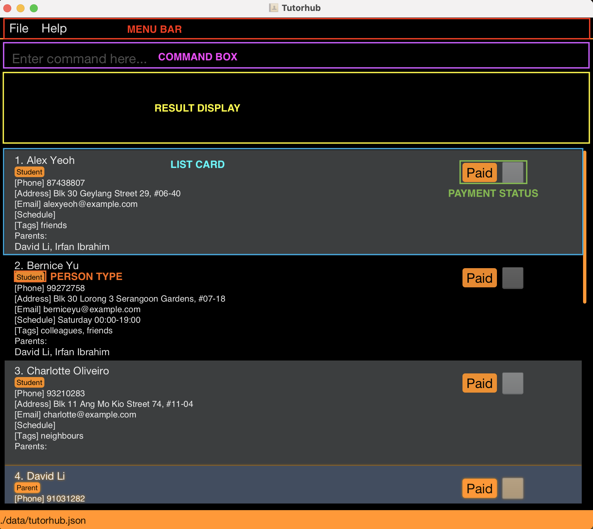
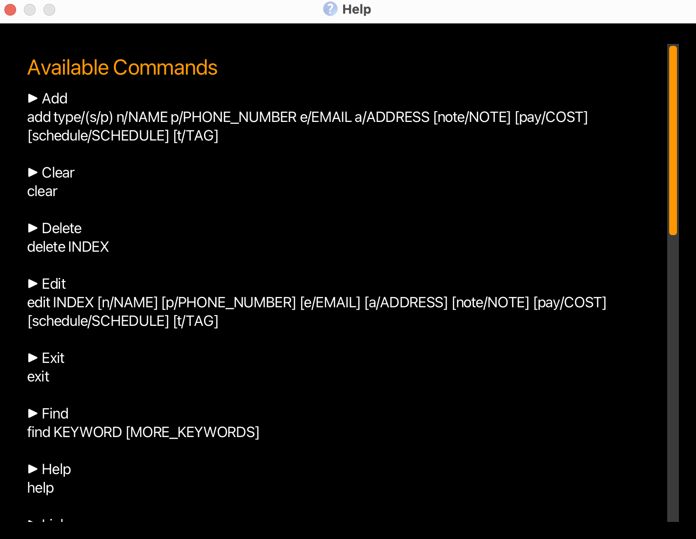
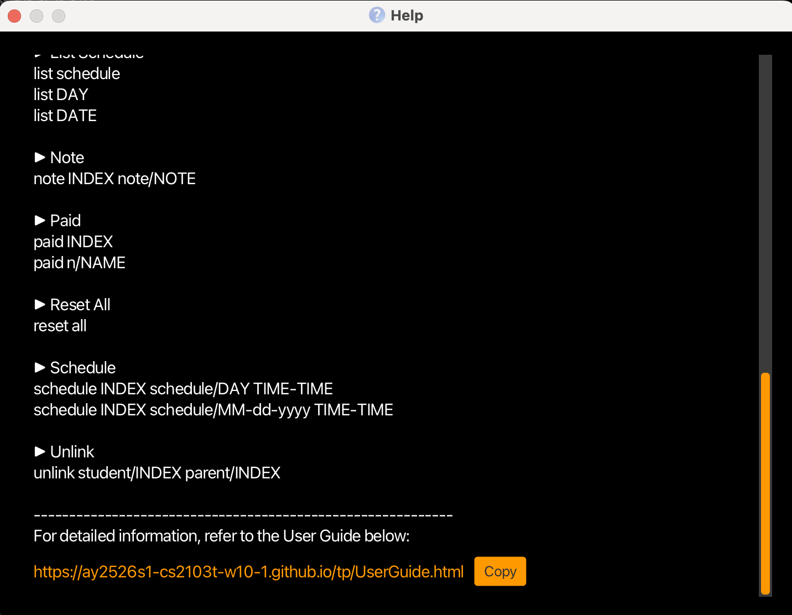
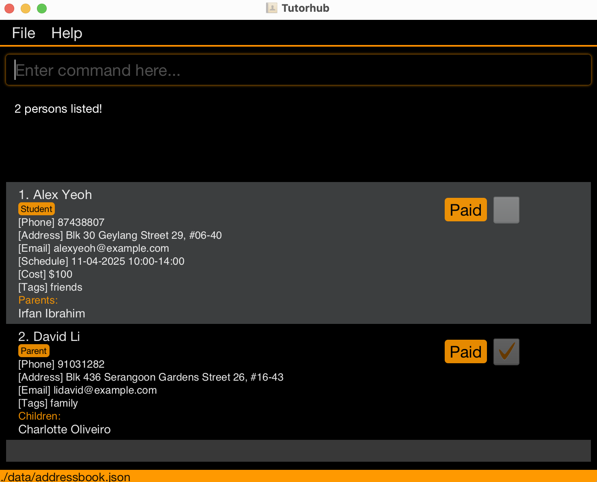
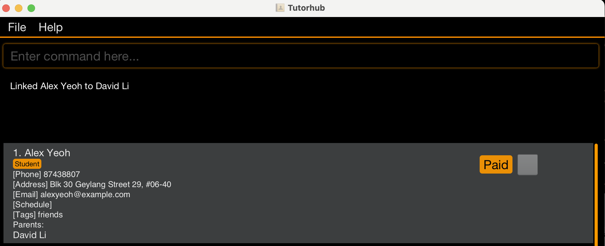
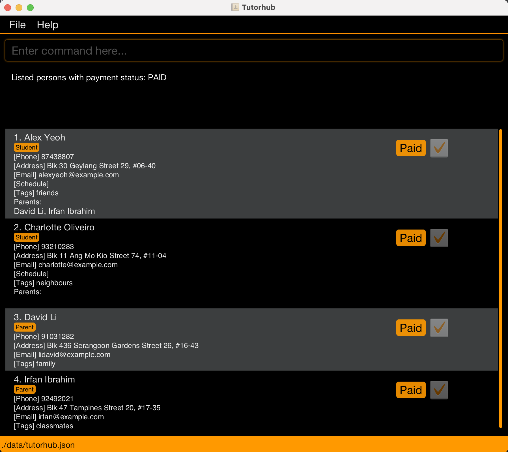
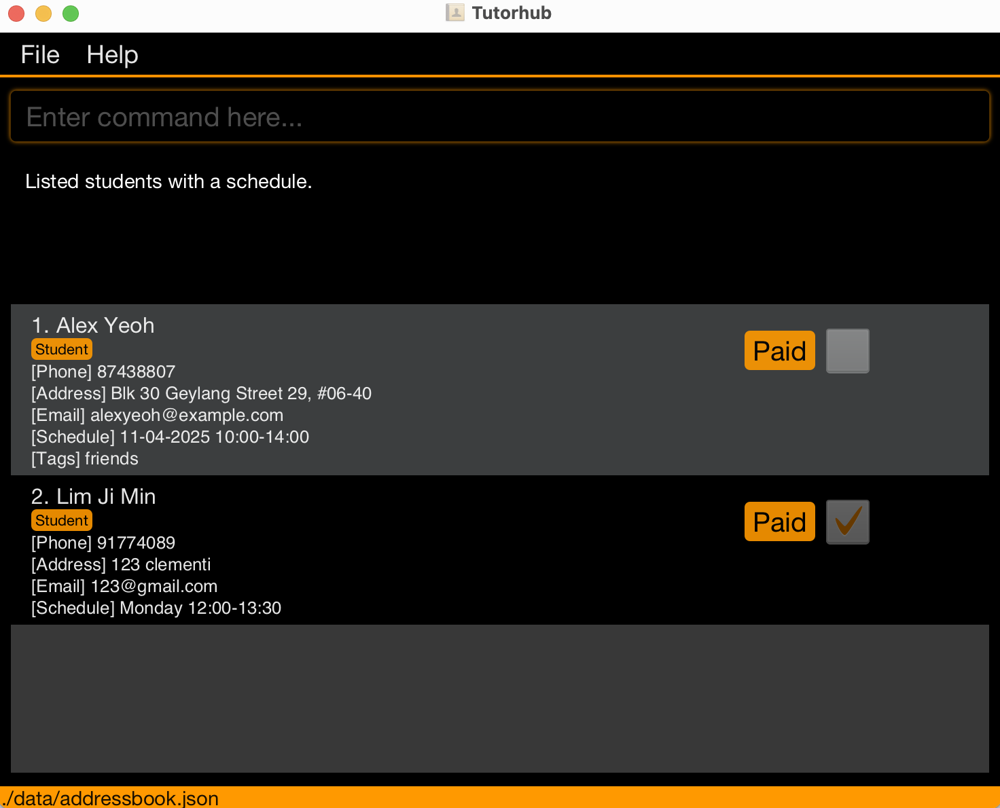

Tutorhub is a **typing-first contact manager for private tutors**.
It helps tutors quickly manage **students, parents, lesson schedules, and payments** — all from one simple Command Line Interface (CLI) backed by a clear Graphical User Interface (GUI).

* Table of Contents
{:toc}

--------------------------------------------------------------------------------------------------------------------


## Target Users


Tutorhub is designed for **private tutors** who manage multiple students and parents.
With Tutorhub, you can:
- Add or edit student and parent details instantly
- Track payment statuses at a glance
- Maintain weekly or one-time lesson schedules
- Link parents to students for easy coordination

--------------------------------------------------------------------------------------------------------------------


## Quick start


1. Ensure you have Java `17` or above installed in your computer.<br>
   **Mac users:** Ensure you have the precise JDK version prescribed [here](https://se-education.org/guides/tutorials/javaInstallationMac.html).


1. Download the latest `.jar` file from [here](https://github.com/AY2526S1-CS2103T-W10-1/tp/releases/tag/v1.3.0).


1. Copy the file to the folder you want to use as the _home folder_ for your Tutorhub.


1. Open a command terminal, `cd` into the folder you put the jar file in, and use the `java -jar tutorhub.jar` command to run the application.<br>
   A GUI similar to the one below should appear in a few seconds. Note how the app contains some sample data.<br>


##  GUI Overview




| Component          | Description                                               |
|--------------------|-----------------------------------------------------------|
| **Menu Bar**       | Access `Help` and other options                           |
| **Command Box**    | Type commands here                                        |
| **Result Display** | Shows feedback after each command                         |
| **List Card**      | Displays all recorded information on Students and Parents |
| **Payment Status** | Shows whether student/parent have paid                    |
| **Person Type**    | Shows whether person is student or parent                 |


1. Type the command in the command box and press Enter to execute it. e.g. typing **`help`** and pressing Enter will open the help window.<br>
   Some example commands you can try:


* `list` : Lists all contacts.


* `add type/s n/John Doe p/98765432 e/johnd@example.com a/John street, block 123, #01-01` : Adds a contact named `John Doe` to the address book.


* `delete 3` : Deletes the 3rd contact shown in the current list.


* `clear` : Deletes all contacts.


* `exit` : Exits the app.


1. Refer to the [Features](#features) below for details of each command.


--------------------------------------------------------------------------------------------------------------------


## Features


<div markdown="block" class="alert alert-info">


**:information_source: Notes about the command format:**<br>


* Words in `UPPER_CASE` are the parameters to be supplied by the user.<br>
  e.g. in `add n/NAME`, `NAME` is a parameter which can be used as `add n/John Doe`.


* Items in square brackets are optional.<br>
  e.g. `n/NAME [t/TAG]` can be used as `n/John Doe t/friend` or as `n/John Doe`.


* Items with `…`​ after them can be used multiple times including zero times.<br>
  e.g. `[t/TAG]…​` can be used as ` ` (i.e. 0 times), `t/friend`, `t/friend t/family` etc.


* Parameters can be in any order.<br>
  e.g. if the command specifies `n/NAME p/PHONE_NUMBER`, `p/PHONE_NUMBER n/NAME` is also acceptable.


* Extraneous parameters for commands that do not take in parameters (such as `help`, `exit` and `clear`) will be ignored.<br>
  e.g. if the command specifies `help 123`, it will be interpreted as `help`.


* If you are using a PDF version of this document, be careful when copying and pasting commands that span multiple lines as space characters surrounding line-breaks may be omitted when copied over to the application.
</div>


### Viewing help : `help`


Shows a list of all commands accepted in Tutorhub.
* The link to this User Guide can be found at the bottom.




Format: `help`


### Adding a person: `add`


Adds a person to the address book. There are 2 types of person to be added: Parent and Student. Simply indicate which one you wish to add with type/


Format: `add type/TYPE n/NAME p/PHONE_NUMBER e/EMAIL a/ADDRESS [t/TAG] [pay/COST] [note/NOTE] [schedule/SCHEDULE]​`


<div markdown="span" class="alert alert-primary">
:bulb: **Tip:**<br>
A person can have any number of tags (including 0) <br>
Tag names may contain spaces (e.g., t/needs review, t/very important). <br>
Leading and trailing whitespace is ignored (e.g., t/ math → math). <br>
Tag names must be alphanumeric and spaces only.  <br>
</div>


Examples:
* `add type/p n/John Doe p/98765432 e/johnd@example.com a/John street, block 123, #01-01 `
* `add type/s n/Betsy Crowe e/betsycrowe@example.com a/Yishun avenue p/99999999 t/Bad at Math schedule/Monday 14:00-15:00 `
* `add type/p n/Jeremiah p/92345489 e/jerry@example.con a/Bowling drive t/Likes golf t/friend`


<div markdown="block" class="alert alert-info">
**:information_source: Important:**<br>
Only Students can add a schedule.
</div>


### Editing a person : `edit`


Edits an existing person in the address book.


Format: `edit INDEX [n/NAME] [p/PHONE] [e/EMAIL] [a/ADDRESS] [t/TAG] [pay/COST] [note/NOTE] [schedule/SCHEDULE]`


* Edits the person at the specified `INDEX`.
* At least one of the optional fields must be provided.
* Existing values will be updated to the input values.
* When editing tags, the existing tags of the person will be removed e.g. adding of tags is not cumulative.
* You can remove all the person’s tags by typing `t/` without
  specifying any tags after it.


Examples:
*  `edit 1 p/91234567 e/johndoe@example.com` Edits the phone number and email address of the 1st person to be `91234567` and `johndoe@example.com` respectively.
*  `edit 2 n/Betsy Crower t/` Edits the name of the 2nd person to be `Betsy Crower` and clears all existing tags.

<div markdown="span" class="alert alert-warning">
:exclamation: **Caution:**<br>


You cannot edit a person's type. Delete and re-add with the desired type. <br>
You cannot edit a parent's cost. The parent's cost is linked to their children.
</div>


### Locating persons by name: `find`


Finds persons whose names contain any of the given keywords.


Format: `find KEYWORD [MORE_KEYWORDS]`


* The search is case-insensitive. e.g. `hans` will match `Hans`
* The order of the keywords does not matter. e.g. `Hans Bo` will match `Bo Hans`
* Only the name is searched.
* Only full words will be matched e.g. `Han` will not match `Hans`
* Persons matching at least one keyword will be returned (i.e. `OR` search).
  e.g. `Hans Bo` will return `Hans Gruber`, `Bo Yang`


Examples:
* `find John` returns `john` and `John Doe`
* `find alex david` returns `Alex Yeoh`, `David Li`. It should appear as such:<br>



### Deleting a person : `delete`


Deletes the specified person from the address book.


Format: `delete INDEX`


* Deletes the person at the specified `INDEX`.
* The index refers to the index number shown in the displayed person list.
* The index **must be a positive integer** 1, 2, 3, …​


Examples:
* `delete 3` deletes the 3rd person in the current view of the address book
* `list` followed by `delete 2` deletes the 2nd person in the address book.
* `find Betsy` followed by `delete 1` deletes the 1st person in the results of the `find` command.


### Clearing all entries : `clear`


Clears all entries from the address book.


Format: `clear`


### Linking Parents to Students : `link`


Tutors often need to know which parents belong to which students and vice versa. This feature allows **maintaining a clear relationship map**.


* Students can be **linked to multiple Parents** (e.g., mother and father).
* Parents can be **linked to multiple Students** (e.g., siblings).
* The linkage is **bidirectional**: once linked, **both profiles** are updated.


Format: `link student/INDEX parent/INDEX`


* Links the student to the parent at the specified `INDEX`s.
* The index refers to the index number shown in the displayed person list.
* The index **must be a positive integer** 1, 2, 3, …​.
* Each index must correspond to the correct type.
* The order of prefixes is flexible.


Example:
* `link student/1 parent/6`
* `list paid` followed by `link parent/3 student/1` will link the student at the first index and the parent at the third index


All parents linked to a student will appear under the student's profile in the GUI as such:



### Unlinking Parents from Students: `unlink`

In the event of an accidental linkage, this unlinking feature will allow users to undo that.


Format: `unlink student/INDEX parent/INDEX`


* Unlinks the student from the parent at the specified `INDEX`es.
* The index refers to the index number shown in the displayed person list.
* The index **must be a positive integer** 1, 2, 3, …​.
* Each index must correspond to the correct type.


Example:
* `unlink student/2 parent/5` will unlink the student at index 2 and parent at index 5


### Adding a personal note: `note`


Adds a personal note under a student or parent profile.


Format:
`note INDEX note/NOTE`


* Adds a note to the person at the specified `INDEX`.
* Notes longer than **100 characters** are not allowed.
* To **delete** the existing note under a person, simply type `note INDEX` without adding a note value.


Examples:
* `note 1 note/Good at Science` — **Adds a note** under the first person.
* `note 1` — **Deletes the note** under the first person.


<div markdown="span" class="alert alert-primary">
:bulb: **Tip:**<br>
Use the `note` command to record useful or must-know information about a person that isn’t already captured by other fields.
</div>

For more information on the parameters, click [here](#command-parameters).


### Assigning a lesson schedule: `schedule`


The `schedule` command assigns a **fixed weekly day and time** or a **specific date and time** to an existing **student**. This allows tutors to keep track of each student’s class timing directly from the application.


Format:
`schedule INDEX schedule/DAY STARTTIME-ENDTIME`, `schedule INDEX schedule/DATE STARTTIME-ENDTIME`


* Assigns a **weekly** or **date-based** lesson schedule to the student at the specified `INDEX`.
* The `DAY` must be one of `Monday`, `Tuesday`, `Wednesday`, `Thursday`, `Friday`, `Saturday`, or `Sunday` (case-insensitive).
* The `DATE` must be in **MM-DD-YYYY** format, e.g. `12-10-2025`, `04-29-2025`.
* The `STARTTIME` and `ENDTIME` must be in **24-hour format**, e.g. `10:30`, `14:00`.
* `ENDTIME` **must be after** `STARTTIME`.
* If a student already has a schedule, the old one will be **replaced** by the new schedule.
* To **delete** the existing schedule, simply type `schedule INDEX` without specifying any day or time.


Examples:
* `schedule 1 schedule/Monday 16:00-18:00` — **Assigns a Monday schedule** to the first student.
* `schedule 2 schedule/12-10-2025 09:00-10:30` — **Assigns a fixed date schedule** to the second student.
* `schedule 1` — **Deletes** the existing schedule under the first student.

<div markdown="span" class="alert alert-info">
:information_source: **Note:**<br>
Tutorhub automatically formats the day and time for readability.
Typing variations such as extra spaces, lowercase letters, or uppercase day names will still be processed correctly.
</div>


<div markdown="span" class="alert alert-warning">
:exclamation: **Caution:**<br>
Schedule can only be added to a student, not a parent.
 Schedules cannot cross midnight.
</div>

For more information on the parameters, click [here](#command-parameters).


### Adding cost per lesson for each Student : `pay/`


Assigns a cost to a contact when adding them as contact. This allows tutors to keep track of the tuition costs of each student.


* Assigns a specific cost of lesson to the student
* COST must be a numeric value, e.g. 72.5
* To edit the COST of a specific student, simply type `edit INDEX ... pay/COST`


Format:
`add type/s ... pay/COST`


Examples:
* `add n/malcolm type/s ... pay/100` - Adds a student named malcolm whose cost per lesson is $100
* `edit 1 pay/100` - edits contact at INDEX 1 to have cost be $100


The cost appears in the GUI under the student’s profile as:
```
[Cost] $100
```

<div markdown="span" class="alert alert-info">
:information_source: **Note:**<br>
Tutorhub automatically syncs the costs of both parents and child to each other. The cost of each parent is equivalent to the sum of the costs of the children.
</div>


### Listing Contacts by Payment status or Schedule: `list`


The `list` command displays **contacts filtered by their payment status or lesson schedule**.
It allows tutors to quickly check which students have paid, who hasn’t, and when lessons are scheduled — all within the main contact list view.


Format:
`list`
`list paid`
`list unpaid`
`list schedule`
`list <DAY>`
`list <DATE>`


* Can filter contacts based on:
    - **Payment status** (`paid` / `unpaid`)
    - **Schedule status** (`schedule`, `<DAY>`, `<DATE>`)
* Both command and arguments are **case-insensitive** (e.g., `LIST`, `List`, `list` all work).
* Tutorhub is **whitespace-tolerant** — extra spaces before or after inputs are ignored 
* The `<DAY>` argument accepts weekdays such as `Monday` to `Sunday`, regardless of case.
* The `<DATE>` argument must follow the `MM-DD-YYYY` format (e.g., `12-12-2025`).
* **Invalid arguments** will result in an error message prompting the correct format.


Examples:
* `list` — Displays **all contacts** in the address book.
* `list unpaid` — Shows all contacts whose payment status is marked as **Unpaid**.
* `LIST   UNPAID` — Works as well; command is **case-insensitive** and ignores extra spaces.
* `list Monday` — Displays students whose schedules fall on **Monday**.
* `list 12-12-2025` — Displays students with a lesson scheduled on **12th December 2025**.
* `list paid` — Shows all contacts whose payment status is marked as **Paid**. It should appear in the GUI as such:

* `list schedule` — Displays only students with **an existing schedule**. It should appear in the GUI as such:


<div markdown="span" class="alert alert-info">
:information_source: **Note:**<br>
Tutorhub automatically formats and displays only valid contacts based on the chosen filter.
Typing variations in spacing, capitalisation, or argument order will still be recognised.
</div>


<div markdown="span" class="alert alert-warning">
:exclamation: **Caution:**<br>
Ensure that dates entered follow the exact `MM-DD-YYYY` format.
Invalid inputs such as `list 2025-12-12` or `list abc` will produce an error message.
</div>


For more information on the parameters, click [here](#command-parameters).


### Tracking payment status of each Student : `paid`


Toggles payment status of specified contact between paid and unpaid. This allows tutors to keep track of the payment status of individual students as well as the parents.


Examples:
* `paid 1`-toggles payment status of contact at INDEX 1
* `paid n/Alex yeoh`- toggles payment status of contact named Alex Yeoh


<div markdown="span" class="alert alert-info">
:information_source: **Note:**<br>
Tutorhub automatically keeps track of students and parents payment status dynamically. If all of a given parent's linked students have paid, the parents payment status will also be paid and vice versa.
</div>

<div markdown="span" class="alert alert-primary">
:bulb: **Tip:**<br>
Use the `paid` command to track whether a student has paid you for a lesson. The payment status will be displayed in the GUI using a checkbox in the top right corner.
</div>


### Resetting payment status for every Student : `reset all`
Resets the payment status of all contacts (both Students and Parents) to unpaid.
Useful for starting a new billing cycle (e.g., weekly or monthly) when all payments need to be cleared.


* Resets all contacts’ `PaymentStatus` to `unpaid`.
* The command is **not case-sensitive** (e.g., `RESET ALL`, `Reset All` work).
* Only accepts the exact phrase `reset all`. Any extra words or tokens are rejected.
* Has no effect on contacts that are already unpaid.


Format:
`reset all`


Examples:
* `reset all` — Resets all contacts to unpaid.
* `RESET ALL` — Works the same (case-insensitive).
* `reset all now` — Invalid. Shows: *Error: invalid format. Use "reset all" only.*


<div markdown="span" class="alert alert-primary">
:bulb: **Tip:**<br>
Use the `reset all` command at the start of each billing cycle to quickly clear all previous payment records.
</div>


### Exiting the program : `exit`

Exits the program.


Format: `exit`


### Saving the data


Tutorhub data are saved in the hard disk automatically after any command that changes the data. There is no need to save manually.


### Editing the data file


Tutorhub data are saved automatically as a JSON file `[JAR file location]/data/addressbook.json`. Advanced users are welcome to update data directly by editing that data file.


<div markdown="span" class="alert alert-warning">:exclamation: **Caution:**
If your changes to the data file makes its format invalid, Tutorhub will discard all data and start with an empty data file at the next run. Hence, it is recommended to take a backup of the file before editing it.<br>
Furthermore, certain edits can cause the Tutorhub to behave in unexpected ways (e.g., if a value entered is outside the acceptable range). Therefore, edit the data file only if you are confident that you can update it correctly.
</div>


--------------------------------------------------------------------------------------------------------------------

## FAQ

**Q**: How do I transfer my data to another Computer?<br>
**A**: Install the app in the other computer and overwrite the empty data file it creates with the file that contains the data of your previous Tutorhub home folder.


**Q**: Why do parents not have a schedule field?<br>
**A**: Schedule field is meant to track classes for students and since parents could have multiple students linked to them, it would be better to only allow students to have a schedule.


**Q**: Can I import or export data in CSV format?<br>
**A**: Not in the current version. However, since data is stored as a JSON file, you can convert it manually to CSV using online tools if needed.

**Q**: Can I change a student’s schedule or note using the `edit` command instead of `schedule` or `note`?<br>
**A**: Yes! Both note and schedule fields can be updated using either their respective commands or the edit command.
Using schedule or note directly may be faster if you only want to change those fields.

**Q**:  Why can I only add Singaporean phone numbers? <br>
**A**: As we are currently only planning to release this for Singaporean tutors we only allow Singapore phone numbers for simplicity. 

--------------------------------------------------------------------------------------------------------------------


## Known issues


1. **When using multiple screens**, if you move the application to a secondary screen and later switch back to a single (primary) screen, the GUI may reopen off-screen.<BR>
   **Remedy:** Delete the `preferences.json` file created by the application before running it again.


2. **If you minimize the Help Window** and then run the `help` command (or use the `Help` menu or `F1` shortcut) again, the original Help Window remains minimized and no new window appears.<BR>
   **Remedy:** Manually restore the minimized Help Window.


3. **Schedules cannot cross midnight.**
   The `schedule` command does not allow time ranges that pass through midnight (e.g., `23:00-01:00`).<BR>
   **Reason:** The system assumes lessons do not continue past midnight and currently enforces a same-day time window.<BR>
   **Remedy:** None required; this is an intended safeguard.


4. **Multiple students can share the same time slot.**
   Tutorhub allows two or more students to have overlapping schedules (e.g., both `Monday 16:00-18:00`).<BR>
   **Reason:** This accommodates group or concurrent lessons rather than enforcing one-to-one tutoring exclusivity.<BR>
   **Remedy:** None required; this behaviour is intended.

5. **Filters reset after any new command.**
    Performing another command (e.g., `add`, `edit`, `paid`) immediately after a filtered `list` command (such as `list paid` or `list monday`) resets the filter and displays the **entire contact list** again.<BR>
    **Reason:** The `list` filter is designed as a temporary view rather than a persistent mode.<BR>
    **Remedy:** Re-enter the desired `list` filter command after completing any action to restore the filtered view.


--------------------------------------------------------------------------------------------------------------------


## Command summary


Action | Format, Examples
--------|------------------
**Add** | `add n/NAME type/TYPE p/PHONE_NUMBER e/EMAIL a/ADDRESS [t/TAG] [pay/COST] [note/NOTE] [schedule/SCHEDULE]` <br> e.g., `add type/s n/James Ho p/99999999 e/jamesho@example.com a/123, Clementi Rd, 1234665 t/friend t/colleague`
**Clear** | `clear`
**Delete** | `delete INDEX`<br> e.g., `delete 3`
**Edit** | `edit INDEX [n/NAME] [p/PHONE] [e/EMAIL] [a/ADDRESS] [t/TAG] [pay/COST] [note/NOTE] [schedule/SCHEDULE]​`<br> e.g.,`edit 2 n/James Lee e/jameslee@example.com`
**Find** | `find KEYWORD [MORE_KEYWORDS]`<br> e.g., `find James Jake`
**List** | `list`, `list paid`, `list unpaid`, `list schedule`, `list <DAY>`, `list <DATE>` <br> e.g., `list Monday` or `List 12-10-2025`
**Help** | `help`
**Schedule** | `schedule INDEX schedule/DAY STARTTIME-ENDTIME`, `schedule INDEX schedule/DATE STARTTIME-ENDTIME` ,`schedule INDEX`
**Note** | `note INDEX note/NOTE`, `note INDEX`
**Paid** | `paid INDEX` or `paid n/NAME`
**Reset all** | `reset all`
**Link** | `link student/INDEX parent/INDEX`
**Unlink** | `unlink student/INDEX parent/INDEX`


## Command Parameters
This section lists every parameter and prefix used in Tutorhub commands.
Each prefix represents a specific input field, and constraints define what values are accepted.


<div markdown="block" class="alert alert-info">
:information_source: **Note:**
If a command specifies that a prefix is optional (e.g., `n/NAME [t/TAG]`),
leaving it blank (e.g., `n/NAME t/`) is treated as if it was omitted.
</div>

<div style="page-break-after: always;"></div>

| **Parameter** | **Prefix** | **Description / Usage**               | **Constraints / Accepted Values**                                                                                                                                                |
|----------------|------------|---------------------------------------|----------------------------------------------------------------------------------------------------------------------------------------------------------------------------------|
| **Name** | `n/` | Specifies the full name of a contact. | Must contain only alphanumeric characters and spaces (whitespace-insensitive). Special characters (e.g., `/`, `-`) are not supported.                                            |
| **Type** | `type/` | Indicates whether the contact is a **student** or **parent**. | Accepts `s` for student or `p` for parent (case-insensitive).                                                                                                                    |
| **Phone Number** | `p/` | Specifies the contact’s phone number. | Must contain 8 digits.                                                                                                                                                           |
| **Email** | `e/` | Stores the contact’s email address. | Must follow the format `name@example.com`.                                                                                                       |
| **Address** | `a/` | Stores the contact’s address or location. | Can take any value, up to 200 characters.                                                                                                                                        |
| **Tag** | `t/` | Categorises the contact (e.g., subject or relationship). | Accepts any multiple-word tag. Multiple tags allowed.                                                                                                                            |
| **Payment per Lesson** | `pay/` | Sets the cost of a student’s lesson.  | Must be a positive numeric value (e.g., `pay/80`).                                                                                                                               |
| **Schedule** | `schedule/` | Sets the student’s weekly or date-specific class timing. | Accepts either a **day** (`Monday`–`Sunday`) or **date** (`MM-DD-YYYY`), followed by `STARTTIME-ENDTIME` in 24-hour format. Does **not** support time ranges that cross midnight. |
| **Note** | `note/` | Adds a note to a student’s profile.   | Any text up to 100 characters. Typing `note INDEX` removes existing note.                                                                                                        |
| **Status (Payment)** | `paid` / `unpaid` | Indicates whether a student has paid for their lesson. | Used only in `list` filters or toggled via the `paid` command.                                                                                                                   |
| **Day / Date** | `<DAY>` / `<DATE>` | Used in filtering or scheduling commands. | `<DAY>` accepts weekdays (case-insensitive). `<DATE>` follows `MM-DD-YYYY` format.                                                                                               |
| **Index** | (no prefix) | Identifies a contact’s position in the displayed list. | Must be a positive integer (e.g., `1`, `2`, `3`, …).                                                                                                                             |
| **Relationship (Link)** | `student/` `parent/` | Used in `link` and `unlink` commands to connect students with parents. | Both must be valid indices from the current list.                                                                                                                                |
| **List Filters** | *(argument)* | Used in `list` to filter by payment or schedule. | Accepts: `paid`, `unpaid`, `schedule`, `<DAY>`, or `<DATE>`. Case and spacing insensitive.                                                                                       |


##  Glossary

| Term                       | Definition                                                                                                   |
|----------------------------|--------------------------------------------------------------------------------------------------------------|
| **CLI**                    | Command Line Interface: where you type commands                                                              |
| **GUI**                    | Graphical User Interface: the visual screen Tutorhub displays                                                |
| **JSON**                   | JavaScript Object Notation: Data format used to store Tutorhub information                                   |
| **Index**                  | The number shown beside each contact in the list panel                                                       |
| **Parent**                 | A guardian linked to one or more students                                                                    |
| **Student**                | A child receiving tuition linked to one or more parents                                                      |
| **Schedule**               | The assigned day and time for a student’s lesson                                                             |
| **Note**                   | Free-text field for extra information about a student or parent                                              |
| **Reset all**              | Command to reset payment status of all contacts to unpaid, typically used at start of new billing cycle      |
| **Link**                   | Bidirectional relationship between a student and parent, allowing cost aggregation and relationship tracking |
| **Payment Status**         |  Indicator (paid/unpaid) of whether a student’s lesson fees are settled                                      |
